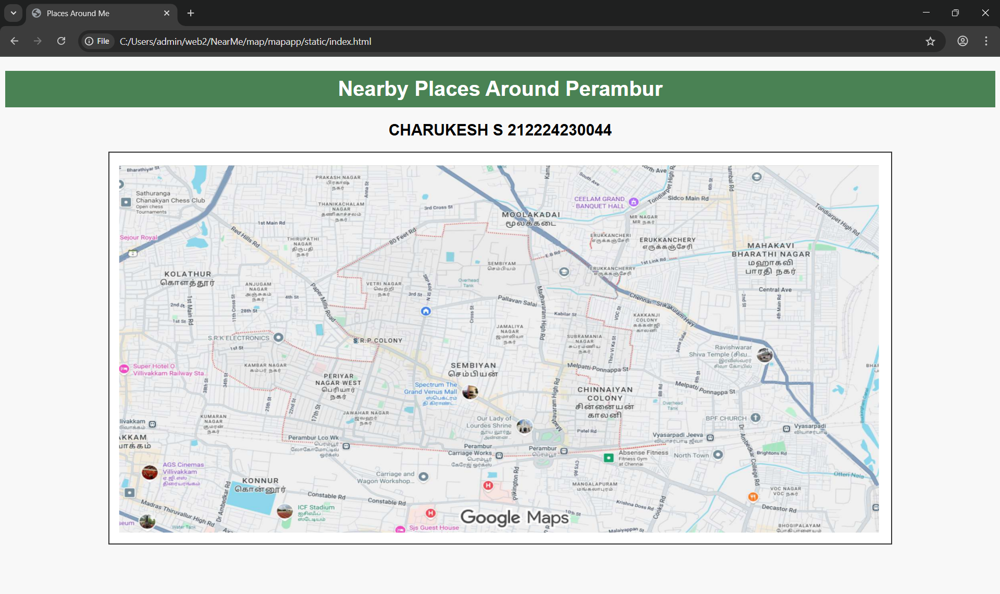
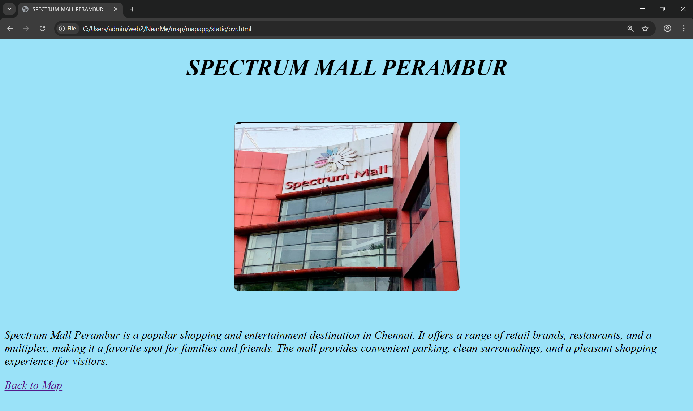
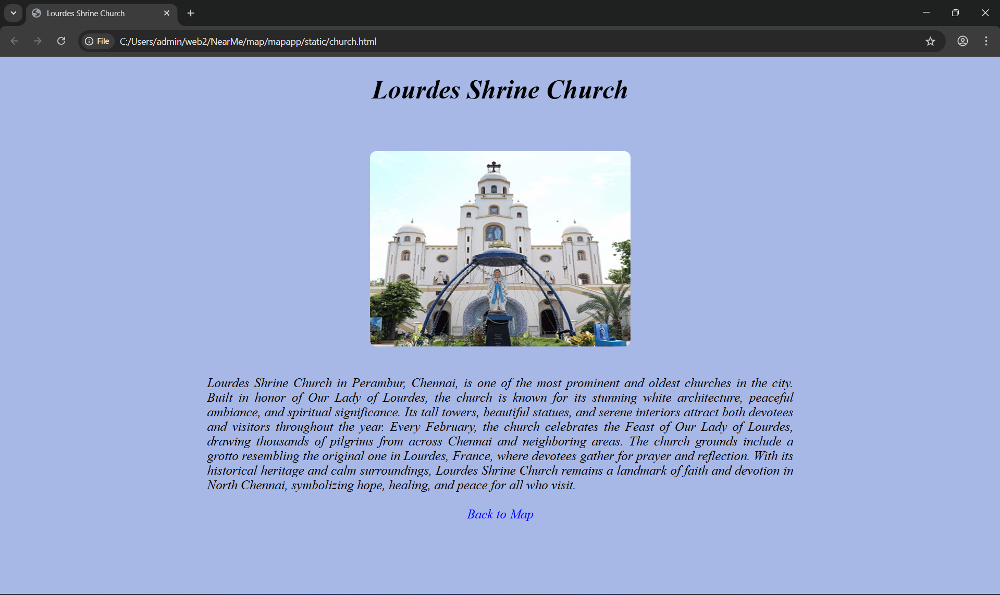

# Ex04 Places Around Me
## Date: 

## AIM
To develop a website to display details about the places around my house.

## DESIGN STEPS

### STEP 1
Create a Django admin interface.

### STEP 2
Download your city map from Google.

### STEP 3
Using ```<map>``` tag name the map.

### STEP 4
Create clickable regions in the image using ```<area>``` tag.

### STEP 5
Write HTML programs for all the regions identified.

### STEP 6
Execute the programs and publish them.

## CODE
```html
index.html:

<!DOCTYPE html>
<html>
<head>
  <title>Places Around Me</title>
  <style>
    body {
      font-family: Arial;
      background: #f8f8f8;
      text-align: center;
    }
    h1 {
      background: #4a8254;
      color: white;
      padding: 10px;
    }
    img {
      border: 2px solid #333;
      width: 1200px;
      height: 600px;
    }
  </style>
</head>
<body>
  <h1>Nearby Places Around Perambur</h1>
  <h2>CHARUKESH S 212224230044</h2>

  
  <map name="places">
    <area shape="circle" coords="1090,480,40" href="vr.html" alt="VR Chennai">
    <area shape="rect" coords="1010,350,1120,400" href="grt.html" alt="GRT Jewellers Thirumangalam">
    <area shape="rect" coords="450,500,550,560" href="skv.html" alt="SKV Mahal">
    <area shape="rect" coords="620,480,740,540" href="fireball.html" alt="Fireball Fitness Club">
    <area shape="rect" coords="900,260,1030,320" href="mmm.html" alt="Madras Medical Mission Hospital">
    <area shape="circle" coords="400,220,40" href="copper.html" alt="Copper Kitchen Mogappair">
  </map>
</body>
</html>

pvr.html:

<!DOCTYPE html>
<html>
<head><title>SPECTRUM MALL PERAMBUR</title></head>
<style>
  body {
    background-color: #9ae2f8;
    font-style: italic;
    font-size: 20px;
  }
</style>
<body>
<h1 align="center">SPECTRUM MALL PERAMBUR</h1>
<br><br>

<!-- Adjusted image size -->


<br><br>
<p>Spectrum Mall Perambur is a popular shopping and entertainment destination in Chennai. It offers a range of retail brands, restaurants, and a multiplex, making it a favorite spot for families and friends. The mall provides convenient parking, clean surroundings, and a pleasant shopping experience for visitors.</p>

<a href="index.html">Back to Map</a>
</body>
</html>

Ayyappan.html:

<!DOCTYPE html>
<html>
<head><title>Ayyappan Temple</title></head>
<style>
    body {
      background-color: #f1d4a4;
      font-style: italic;        
      font-size: 20px;
    }
  </style>
<body>
<h1 align="center">Ayyappan Temple</h1>

<br>
<p>Ayyappan Temple in Perambur, Chennai, is a peaceful and sacred place dedicated to Lord Ayyappa, the revered deity of devotion and discipline. The temple follows traditional Kerala-style architecture, featuring beautifully carved gopurams and a calm atmosphere that inspires spiritual reflection. Every morning and evening, devotees gather for prayers and bhajans, creating a divine ambiance filled with the sound of bells and chants.
The temple becomes especially vibrant during the Mandala Pooja and Makara Vilakku festivals, when hundreds of devotees visit to offer prayers and participate in rituals. The temple priests perform regular poojas and special abhishekams, maintaining the sanctity and purity of the shrine..</p>
<a href="index.html">Back to Map</a>
</body>
</html>

church.html:

<!DOCTYPE html>
<html>
<head><title>Lourdes Shrine Church</title></head>
<style>
  body {
    background-color: #a8b8e6;
    font-style: italic;        
    font-size: 20px;
  }
</style>
<body>
<h1 align="center">Lourdes Shrine Church</h1>
<br><br>

<!-- Adjusted image size -->


<br><br>
<p style="text-align:justify; max-width:900px; margin:auto;">
 Lourdes Shrine Church in Perambur, Chennai, is one of the most prominent and oldest churches in the city. Built in honor of Our Lady of Lourdes, the church is known for its stunning white architecture, peaceful ambiance, and spiritual significance. Its tall towers, beautiful statues, and serene interiors attract both devotees and visitors throughout the year.
Every February, the church celebrates the Feast of Our Lady of Lourdes, drawing thousands of pilgrims from across Chennai and neighboring areas. The church grounds include a grotto resembling the original one in Lourdes, France, where devotees gather for prayer and reflection.
With its historical heritage and calm surroundings, Lourdes Shrine Church remains a landmark of faith and devotion in North Chennai, symbolizing hope, healing, and peace for all who visit.
</p>

<br>
<div align="center">
  <a href="index.html" style="color:blue; text-decoration:none;">Back to Map</a>
</div>

</body>
</html>


## OUTPUT

Index.html:


pvr.html:


Ayyappan.html:


church.html:


## RESULT
The program for implementing image maps using HTML is executed successfully.
